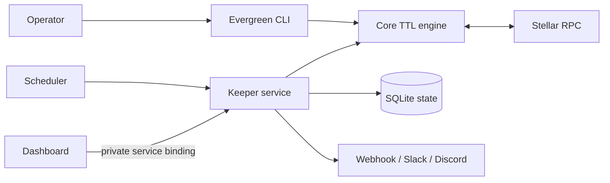

# Evergreen

**Automated TTL monitoring and guarded state preservation for Stellar Soroban contracts.**

[](https://github.com/Evergreen-production/evergreen/actions/workflows/ci.yml)
[](https://github.com/Evergreen-production/evergreen/actions/workflows/codeql.yml)
[](https://github.com/Evergreen-production/evergreen/releases/latest)
[](LICENSE)
[](https://developers.stellar.org/docs/build/smart-contracts)

[Live dashboard](https://evergreen-labs.vercel.app) · [Documentation](https://entity-6.gitbook.io/evergreen-documentation/) · [Quickstart](docs/using/quickstart.md) · [Security](SECURITY.md)

Soroban ledger entries have a finite time to live. When contract instance, code, or persistent data expires, applications can lose access until the state is restored. Evergreen turns that operational risk into a monitored workflow: inspect TTLs, classify risk, alert operators, simulate remediation, and—when explicitly enabled—extend or restore entries within strict fee limits.

## Why Evergreen

- **Early warning:** classify entries as healthy, warning, critical, or archived.
- **Safe automation:** simulate before signing and enforce per-transaction and daily spend caps.
- **Operator visibility:** expose a read-only status API and live dashboard.
- **Flexible operation:** use the CLI for one-shot checks or the keeper for scheduled monitoring.
- **Security by default:** Testnet-first configuration, environment-only signing keys, and read-only operation without a signer.

## Live submission

The public deployment monitors a verified Stellar Testnet contract in read-only mode:

- Dashboard: [evergreen-labs.vercel.app](https://evergreen-labs.vercel.app)
- Contract: [`CCAK6YBIECDQ2GFPMYLV3GWQPJN2DVGJGDHKY76ESZHI56DZMELSTPRV`](https://stellar.expert/explorer/testnet/contract/CCAK6YBIECDQ2GFPMYLV3GWQPJN2DVGJGDHKY76ESZHI56DZMELSTPRV)
- Network: Stellar Testnet

Read-only mode is deliberate for the public demo: it proves live RPC inspection without exposing or funding a signing key. Automated extension activates only when an operator privately configures `EVERGREEN_SECRET_KEY`.

## Architecture



| Component              | Purpose                                                                                   |
| ---------------------- | ----------------------------------------------------------------------------------------- |
| `@evergreen/core`      | Configuration validation, ledger inspection, TTL classification, and transaction planning |
| `@evergreen/cli`       | One-shot checks, dry runs, extensions, and restores                                       |
| `@evergreen/keeper`    | Scheduled scans, guarded execution, state history, alerts, and status API                 |
| `@evergreen/dashboard` | Server-rendered operational view of keeper state                                          |
| `evergreen-ttl`        | Rust helpers for contract-side TTL management                                             |

## Run locally

Requirements: Node.js 20+, pnpm 9+, and Rust for the helper crate.

```bash
git clone https://github.com/Evergreen-production/evergreen.git
cd evergreen
pnpm install --frozen-lockfile
pnpm build
node packages/cli/dist/index.js init
```

Replace the generated contract ID with a Testnet `C...` address, then inspect it:

```bash
node packages/cli/dist/index.js --config evergreen.toml check
node packages/cli/dist/index.js --config evergreen.toml extend --dry-run
```

See the [complete quickstart](docs/using/quickstart.md) for configuration and expected output.

## Safety model

- Secret keys never belong in TOML, source control, logs, or API responses.
- Without `EVERGREEN_SECRET_KEY`, the keeper can inspect but cannot submit transactions.
- Extension and restoration plans are simulated before submission.
- Contract-level fee ceilings and global daily budgets bound signer exposure.
- Mainnet selection is explicit and produces an operator warning.

See the [threat model](docs/threat-model.md) and [production checklist](docs/operations/production-checklist.md).

## Development

```bash
pnpm lint
pnpm typecheck
pnpm test
pnpm build
cargo test --manifest-path crates/evergreen-ttl/Cargo.toml
```

Contributions are welcome. Read [CONTRIBUTING.md](CONTRIBUTING.md) before opening a pull request.

## License

Apache License 2.0. See [LICENSE](LICENSE).
