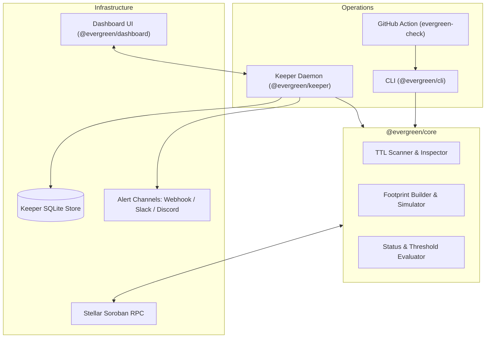

# 🌲 Evergreen

> **Automated TTL & State-Archival Keeper for Soroban Smart Contracts on Stellar**

[](https://github.com/Michealshodipo56/evergreen/actions)
[](LICENSE)
[](docs/config-reference.md)

Soroban contract data, contract instance entries, and contract WASM code entries have a Time To Live (TTL) measured in ledger sequences. If entries are not periodically extended, they become **archived** and contract invocations fail until restored via footprint operations.

**Evergreen** is an open-source TypeScript & Rust toolchain designed to systematically scan, alert, extend, and restore Soroban storage TTLs within strict configurable fee and budget guardrails.

---

## 🚀 5-Minute Quickstart

### 1. Install Evergreen CLI
```bash
pnpm add -g @evergreen/cli
# or run directly with npx / pnpm dlx
pnpm evergreen --help
```

### 2. Initialize Configuration
Generate a starter `evergreen.toml` configuration:
```bash
evergreen init
```

### 3. Check Contract TTL Status
Inspect the TTL state of contract instances, code entries, and persistent storage entries:
```bash
evergreen check --config evergreen.toml
```

### 4. Perform a Dry-Run Extend
Simulate extending low-TTL entries without submitting transactions or spending fee stroops:
```bash
evergreen extend --config evergreen.toml --dry-run
```

### 5. Extend Entries on Testnet
Export your keeper secret key and execute state extension:
```bash
export EVERGREEN_SECRET_KEY="S..."
evergreen extend --config evergreen.toml --yes
```

---

## 🏗️ Architecture & Component Overview



- **`@evergreen/core`**: Pure TS library handling Stellar RPC querying, XDR footprint simulation, fee calculation, and extend/restore transaction assembly.
- **`@evergreen/cli`**: Terminal application (`evergreen`) supporting `init`, `check`, `extend`, `restore`, and `watch` commands with JSON & table output modes.
- **`@evergreen/keeper`**: Production daemon service with scheduled polling, state persistence, daily spend caps, balance alerts, deduplicated notifications, and a read-only HTTP status API.
- **`@evergreen/dashboard`**: Modern Next.js App Router frontend visualizing real-time contract TTL health, active alerts, execution runs, and keeper metrics.
- **`evergreen-ttl`**: Lightweight Rust helper crate for Soroban contract authors to manage storage TTL natively inside contract code.

---

## 📦 Packages in this Monorepo

| Package / Crate | Path | Description |
| :--- | :--- | :--- |
| `@evergreen/core` | [`packages/core`](packages/core) | Core inspection logic, simulation, and transaction builders |
| `@evergreen/cli` | [`packages/cli`](packages/cli) | Command-line interface |
| `@evergreen/keeper` | [`packages/keeper`](packages/keeper) | Daemon service, scheduler, persistent store, and HTTP status API |
| `@evergreen/dashboard` | [`packages/dashboard`](packages/dashboard) | Web visualizer for the Keeper service |
| `evergreen-ttl` | [`crates/evergreen-ttl`](crates/evergreen-ttl) | Rust crate with Soroban storage TTL extension helper functions |
| `evergreen-check` | [`.github/actions/evergreen-check`](.github/actions/evergreen-check) | GitHub Action for automated CI TTL threshold checks |

---

## ⚙️ Configuration Reference

See [`docs/config-reference.md`](docs/config-reference.md) for full details.

Sample `evergreen.toml`:
```toml
network = "testnet"
rpc_url = "https://soroban-testnet.stellar.org"
network_passphrase = "Test SDF Network ; September 2015"

check_interval_seconds = 3600
max_daily_spend_stroops = 10000000 # 1 XLM

[contracts.my_contract]
id = "CCWM6P2N6F5V..."
label = "Core DeFi Pool"
warn_below_days = 30
extend_below_days = 7
extend_to_days = 90
max_fee_stroops = 500000
watch_entries = ["instance", "code"]
```

> 🔒 **Security Note:** Secret keys are **NEVER** placed in `evergreen.toml`. Supply secret keys via the `EVERGREEN_SECRET_KEY` environment variable.

---

## 🛡️ Safety & Security

Evergreen is designed around strict safety defaults:
- **Default Network:** Testnet. Mainnet execution requires explicit flag `--network mainnet` or `network = "mainnet"` with printed warnings.
- **Dry-Run Default:** Single interactive extension commands prompt for confirmation unless `--yes` is specified.
- **Spend Guardrails:** Daily transaction fee caps and per-transaction fee/resource caps prevent run-away account draining.
- **Secret Protection:** Secret keys are strictly stripped from all log outputs, state files, HTTP API responses, and errors.

See [`docs/threat-model.md`](docs/threat-model.md) and [`SECURITY.md`](SECURITY.md).

---

## 📜 License

Licensed under the [Apache License, Version 2.0](LICENSE).
