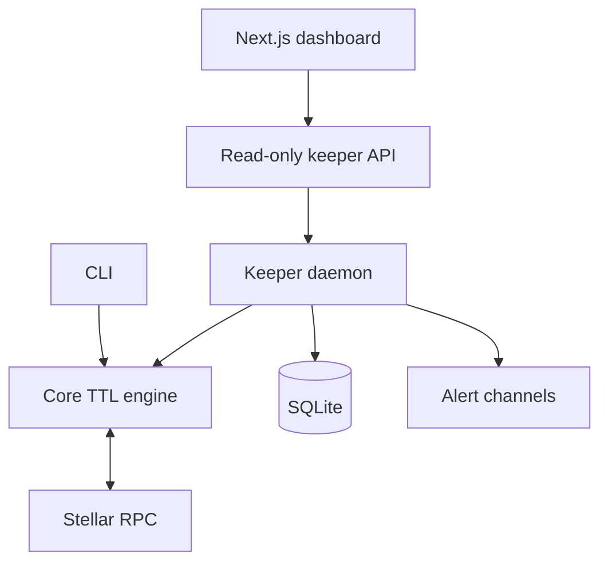

# System Architecture

Evergreen separates deterministic ledger logic from operator interfaces and long-running infrastructure.

## Component boundaries

- **Core** validates configuration, constructs ledger keys, reads TTL data, classifies risk, and builds transaction plans. It does not schedule work or retain state.
- **CLI** exposes explicit one-shot workflows suitable for operators and CI.
- **Keeper** owns scheduling, spend accounting, cooldowns, alerts, and process lifecycle.
- **Dashboard** is a server-rendered consumer of the keeper API and does not receive signer material.
- **Rust helper** gives contract authors reusable contract-side TTL primitives.

## Trust boundaries

Stellar RPC is an external dependency and the keeper signer is the highest-value secret. Signing keys enter only through environment variables and are not written to configuration, SQLite, HTTP responses, or logs. The dashboard-to-keeper channel should remain internal or bearer-authenticated.

## Data flow

1. Configuration identifies contracts and policy thresholds.
2. Core resolves ledger keys and requests current entries from RPC.
3. Remaining ledgers are converted into health classifications.
4. The keeper publishes the snapshot and evaluates remediation policy.
5. When a signer exists, a plan is simulated and checked against caps before submission.
6. Outcomes are recorded and eligible alerts are deduplicated before delivery.
